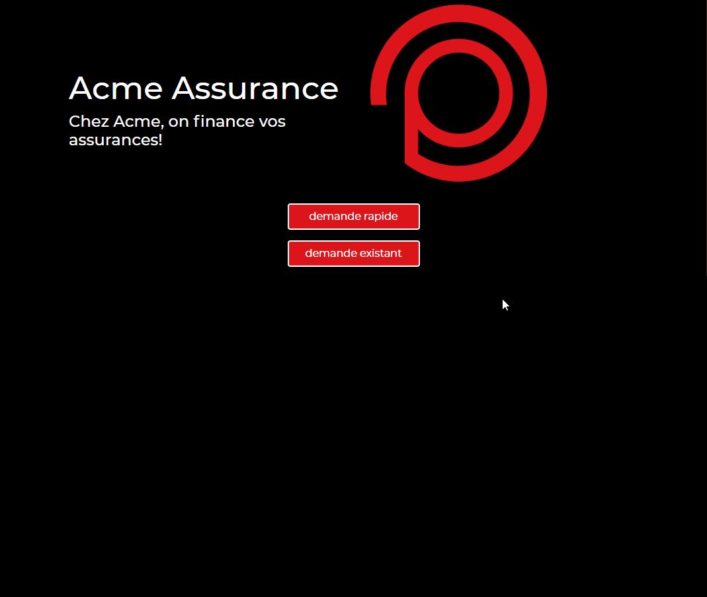

### Acme-Assurance

How to access the project 

1- clone the project
2- add the path of "front" to a virtual host
3- add the path of the PUBLIC folder of "api" to another virtual host
4- in api folder of project, run "composer install"
5- if need be run "php artisan migrate" 

link for detailed description https://devmarketer.io/learn/setup-laravel-project-cloned-github-com/

